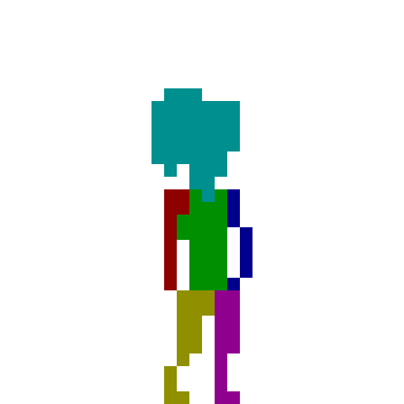
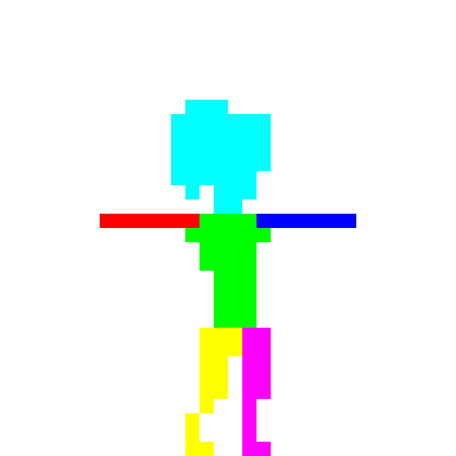
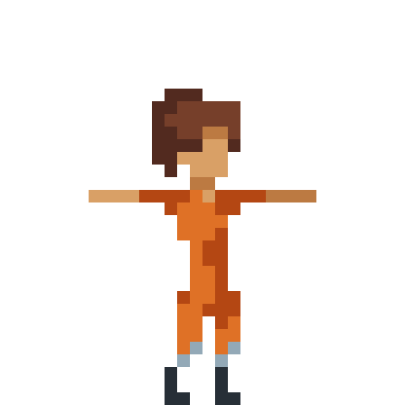

<div align="center">

# PixelMorph

</div>

<div align="center">
  
  
  **AI-powered pixel art texturing**
  
  *Transform animation templates into textured sprites*
</div>

## ✨ Features

- � **Color-Coded Training**: Use simple color maps to define different body parts/regions
- 🤖 **Neural Network Texturing**: Deep learning model learns texture patterns from reference data
- �️ **Multi-Frame Support**: Train on multiple pose variations for better generalization
- ⚡ **CUDA Acceleration**: GPU-powered training and inference for fast processing
- � **Pixel-Perfect Results**: Maintains crisp pixel art aesthetic while adding rich textures
- 🔄 **Pose Transfer**: Apply learned textures to new poses automatically

## 🚀 Quick Start

### Prerequisites

- **Python 3.12.3** (recommended)
- **CUDA-compatible GPU** (recommended for training)
- **PyTorch with CUDA support**

### Installation

1. **Clone the repository:**

   ```bash
   git clone https://github.com/Magicmaan/pixelmorph.git
   cd pixelmorph
   ```

2. **Install dependencies:**
   ```bash
   pip install -r requirements.txt
   ```
3. **If you have trouble installing PyTorch** (e.g., due to CUDA version differences):

   - **Edit `requirements.txt`**: Remove the `torch` and `torchvision` lines.
   - **Install PyTorch manually** for your system and CUDA version by following the [official instructions](https://pytorch.org/get-started/locally/).

   For example, for CUDA 12.1:

   ```bash
   pip install torch torchvision --index-url https://download.pytorch.org/whl/cu121
   ```

   Replace `cu121` with the version matching your GPU and drivers (e.g., `cu118`, `cpu`, etc.).

## 🎮 How to Use

### Step 1: Prepare Your Training Data

Create **at least 3 image pairs** for optimal results. Each pair consists of:

- **UV Map**: Color-coded limb reference (simple flat colors)
- **Texture**: Detailed textured version of the same pose

**Recommended poses:**

- **T-Pose**: Standard reference pose with arms extended
- **Idle**: Relaxed standing position
- **Run Frame**: Dynamic action pose (running/walking frame)

### Step 2: Set Up Directory Structure

Create the following folder structure in your project:

```
pixelmorph/
├── images/
│   ├── uv/           # Color-coded UV maps
│   ├── texture/      # Corresponding textured versions
│   └── target/       # New poses to texture
├── weights/          # Model weights (auto-created)
└── output/           # Generated results (auto-created)
```

### Step 3: Name Your Files

Use consistent naming with numbered suffixes:

**UV Maps** (in `images/uv/`):

- `uv_1.png` - T-Pose UV map
- `uv_2.png` - Idle pose UV map
- `uv_3.png` - Run frame UV map

**Textures** (in `images/texture/`):

- `texture_1.png` - T-Pose textured
- `texture_2.png` - Idle pose textured
- `texture_3.png` - Run frame textured

**Target Images** (in `images/target/`):

- `new_pose.png` - Any new pose you want to texture

#### Example Files:

<div align="center">
  
  
  <br>
  <em>Left: UV Map with color-coded limbs | Right: Corresponding textured version</em>
</div>

### Step 4: Color Code Your UV Maps

Use these exact RGB colors for body parts:

- `RGB(0, 255, 255)` - **Head** (Cyan)
- `RGB(0, 255, 0)` - **Torso** (Green)
- `RGB(255, 0, 0)` - **Left Arm** (Red)
- `RGB(0, 0, 255)` - **Right Arm** (Blue)
- `RGB(255, 255, 0)` - **Left Leg** (Yellow)
- `RGB(255, 0, 255)` - **Right Leg** (Magenta)

### Step 5: Run the Training

```bash
python __main__.py
```

The script will:

1. Load your training data
2. Train the neural network (may take several minutes)
3. Save the trained model to `weights/weights.pth`
4. Apply textures to your target images
5. Save results to `output/` folder

### Expected Output

```
Using device: cuda
Palette size: 156 colors (combined from all training textures)
Using CUDA for training
Model created
Starting training from scratch...
Starting training with 15420 samples...
Epoch 0, Loss: 5.234567
Epoch 50, Loss: 3.456789
...
New pose textured image saved as 'new_pose.png'
CUDA cache cleared
```

## 🧠 How It Works

PixelMorph uses a neural network that learns the relationship between:

1. **Limb Identity**: Which body part (encoded as one-hot vector)
2. **Spatial Position**: Normalized (x,y) coordinates within the limb
3. **Texture Color**: The corresponding RGB color at that position

The model architecture:

- **Input**: Limb one-hot encoding + normalized coordinates (8 features)
- **Hidden**: 2 layers of 64 neurons with ReLU activation
- **Output**: Color palette index classification

## 🎯 Tips for Best Results

- **Use consistent poses**: T-pose, idle, and action frames work well
- **High contrast UV maps**: Make sure limb colors are distinct
- **Detailed textures**: More texture detail = better AI learning
- **Matching poses**: UV and texture pairs must be identical poses
- **Clean edges**: Avoid anti-aliasing on UV map boundaries

## 🛠️ Tech Stack

- **ML Framework**: PyTorch with CUDA support
- **Image Processing**: PIL (Pillow) + NumPy
- **Training**: Adam optimizer with cross-entropy loss
- **Data**: Color palette quantization for consistent training

## 📁 Project Structure

```
pixelmorph/
├── __main__.py              # Main training/inference script
├── requirements.txt         # Python dependencies
├── images/                  # Training and target data
│   ├── uv/                 # Color-coded UV maps
│   ├── texture/            # Reference textures
│   └── target/             # New poses to texture
├── weights/                # Saved model weights
└── output/                 # Generated results
```

## 🛠️ Tech Stack

- **Frontend**: React 19 + TypeScript
- **3D Engine**: Three.js + React Three Fiber
- **UI**: ShadCN + Tailwind CSS
- **State Management**: Zustand
- **Build Tool**: Vite

## 🤝 Contributing

1. Fork the repository
2. Create a feature branch (`git checkout -b feature/amazing-feature`)
3. Commit your changes (`git commit -m 'Add amazing feature'`)
4. Push to the branch (`git push origin feature/amazing-feature`)
5. Open a Pull Request

## 📄 License

This project is licensed under the MIT License - see the [LICENSE](LICENSE) file for details.

## 🙏 Acknowledgments

- PyTorch team for the excellent ML framework
- PIL/Pillow contributors for image processing capabilities
- CUDA team for GPU acceleration support
- Pixel art community for inspiration and techniques
- Special thanks to [aarthificial](https://github.com/aarthificial) for the original idea and inspiration.

---

<div align="center">
  Made with ❤️ for pixel art creators
</div>
